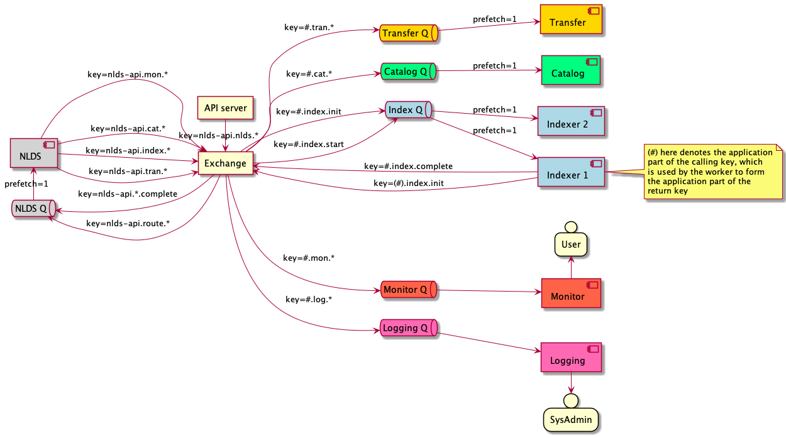
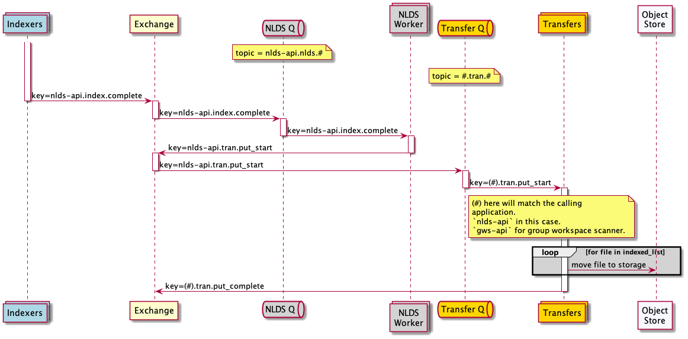

Near Line Data Store (NLDS)
===========================

# Software specification
**Neil Massey 02/11/2021**

# Introduction

As a successor to the Joint Data Migration Application (JDMA), a new storage 
solution is proposed.  This is based on the idea of hot, warm and cold storage:

* hot  = POSIX disk, or SSD.  Expensive in cost and power requirements.
* warm = Object Storage.  Less expensive in cost and power requirements.
* cold = Tape.  Cheapest in cost and power requirements.

(This is all "in theory" costing.)

The main idea is that users are presented with a single (and simple) 
application or API, that follows the CRUD (create, read, update, destroy) 
mnemonic.  Users can issue commands to POST a list of files (a list may 
contain exactly one file), GET a list of files, DELETE a list of files and PUT 
a list of files (update).

This can be via the command line client, or the API that the CLI is built 
upon.  Users issue a transfer command and the NLDS system performs the 
transfer on their behalf.  For example:

```nlds put <file>```

puts a single file onto the NLDS system.

```nlds putlist <filelist>```

will open the `<filelist>` file, read the file names out of the file and put
those files onto the NLDS.

There are equivalent `nlds get <file>` and `nlds getlist <filelist>` files.  
Also, we will have to support `nlds del <file>` and `nlds dellist <filelist>` 
commands.

Eventually, we will add monitoring commands as well.

To overcome some of the problems we had with the JDMA, we propose that the 
NLDS architecture has a "micro-services" setup.  This consists of:

1.  An API server, that clients connect to and issue commands to.  The commands are, as above, the CRUD commands: `put`, `putlist`, `get`, `getlist`, `del`, `dellist`.
2.  A message-broker queue.  The API server translates the user's commands to messages and pushes them onto the message-broker queue.
3.  Micro-service subscribers to the queue.  These micro-services take a message from the queue, perform a task that is encoded in the message, and then push the results back onto the queue for further action.
4.  A transfer processor.
5.  A monitoring and notification system.
6.  A catalogue database, containing the NLDS holdings.

This basic architecture is shown in Figure 1:

|  |
:-:
| **Figure 1** High-level deployment diagram of NLDS. |

# Use cases

## Group Workspace Tape Management

**Purpose**: A group workspace is an allocation of storage to a user or group 
of users (a project) on JASMIN.  It can use different storage media. There is 
a quota for each media type.

**Actors:**
1. GWS user
2. GWS Manager
3. CEDA Archive Manager

**Entities:** 
1. GWS
2. Tape system
3. CEDA Archive

**Actions:**

* A user makes an incremental copy
* A user performs a “back-up” (full or incremental) from other storage to tape 
(the first backup is an increment on nothing)
* Someone writes to tape from Archer and then restores onto disk on JASMIN.
* A GWS user needs to make space on their GWS disk.  They write data to tape 
and then remove the data from disk that has been copied to tape.
* A user wants to discover and pull data from tape, run an analysis and then 
write their results back to tape afterwards.
* Implies metadata scraping on the way in?
* Put data into “time-limited cold storage” for limited period following 
completion of project (limit = 18 months TBC).
* Retrieve GWS data from tape ready for it to be incorporated into the CEDA 
archive via ingest process.
* GWS Manager can check overall tape usage against quota, for their GWS.

## CEDA Archive

**Purpose:** storage management for the CEDA Archive

**Actors:**
1. CEDA Archive manager

**Entities:** 
1. CEDA Archive
2. Tape system

**Actions:**
* Ingest.
* Deposit.
* Storage allocation - what data should go where (should be policy driven 
rather than list driven).
* Setting up a policy for dataset - e.g. disk-only copy with MODIS.
* Maintenance.
* Make archive copies - exact copy of what is in the archive for redundancy.
* Tidy cache copies - partial copies on performance storage.
* Recovery copies - copies with deleted and modified (Backup).
* Fixity Audit.
* Migration - copy and remove (could be archive, cache or recovery copies).
* Access (either for a download service or direct from mounted file system)
* Search
* Request data to cache copy (NLA type behaviour)

# Software components

## NLDS client

* The user interacts with the NLDS client.
* Authorisation tokens are obtained from the OAuth server.
* Commands are issued to the NLDS server, along with the authorisation tokens.
* A transaction ID is generated, which is attached to every message as they 
flow through the system.

## NLDS server

* NLDS client commands are received, along with their authorisation tokens.
* Authorisation tokens are checked with the OAuth server.
* Commands are translated to RabbitMQ commands and pushed to the queue.

## OAuth server

* Performs generation and authorisation of tokens
* Currently JASMIN accounts portal.  Should be able to be something else as 
well.

The interaction of the NLDS client, NLDS server, OAuth server and the ingest of the Rabbit MQ queue is shown in Figure 2.

|  |
:-:
| **Figure 2** Interaction of NLDS client, server, OAuth server and Rabbit MQ message broker. |

# Rabbit MQ queue

The Rabbit MQ queue will have a number of subscribers to it.  These are:
* Work processor
* File / directory scanner
* Transfer processor
* Database processor

## Work Processor
This takes the description of work to do and pre-processes it.  One example is 
if a user has supplied a list of files to transfer, this list might be broken 
up into smaller work units and re-pushed onto the queue.

## File scanner
This takes the description of work that the Work Processor pushed onto the 
queue and starts to build a file list.

Questions :
* Should this work on just POSIX file sets?
* Should it work with object store?
* Should it work on tape catalogue?

At the end it can push two different messages to the queue:
* Scan a directory
* Transfer a list of files from one data storage system to another

If a threshold number of files has been reached then it can:
* Push a message to transfer the files
* Push a message to scan the remainder of the directories

## Transfer processor
This takes the list of files from the File Scanner and transfers them from one 
storage medium to another
At the end it pushes a message to the queue to say it has completed.

## Database processor
Add files and metadata to a file catalogue database.  Intake database?

# Monitoring
Important!
How do we know when a transfer has completed, if it has been split into 
multiple components?

# Messaging

The NLDS relies on passing messages between different components in the 
system.  These messages have to be formatted to match the receiving sysmtem and so different message formats are used:

1.  HTTP API / JSON
2.  RabbitMQ
3.  FTS3
4.  S3

## Rabbit MQ queue structure

|  |
:-:
| **Figure 3** Structure and interaction of Rabbit Queues.  Not all messages are shown.  For example, both `Scanner 1` and `Scanner 2` write `work.scancomplete` messages to the `Work Exchange`.|

## Message flow

### Message flow for a `putlist` command
|  |
:-:
| **Figure 4.1** Flow of messages for a `putlist` case of transferring a list of files to the NLDS. Part 1: from the user submitting the request to the completion of the file scanning|

The file scanner fulfills three purposes:

1. It ensures that the files that the user has supplied in a filelist are actually present.
2. It recursively scans any directories that are in the filelist.
3. It splits the filelist into smaller batches to allow for restarting the transfer, asynchronicity of transfers and allow parallel transfers.

|  |
:-:
| **Figure 4.2** Flow of messages for a `putlist` case of transferring a list of files to the NLDS. Part 2: from the file scan completing (for a sublist of files) to the transfer completing (for the sublist)|

Asynchronicity of the transfers is a desirable byproduct of the scanner splitting the filelist into smaller batches.  It also allows for parallel transfer, with multiple transfer workers.  Finally, if a transfer worker fails, and does not return an acknowledgement message to the Exchange, the message will be sent out again, after a suitable timeout period.

## Message formats

Messages are in JSON format so as to aid human and machine readability.  
The user entry point is the NLDS server, which presents a HTTP API 
(REST-ful), implemented in FAST-API.  This HTTP API fulfills two different 
classes of operations for NLDS: the CRUD (Create, Read, Update, Delete) 
operations, and search operations. 

## CRUD operations

These messages are sent to the NLDS server.  These consist of just 6 
commands.

1. `put` : transfer a single file to the NLDS.
2. `putlist` : transfer a user-supplied list of files to the NLDS.
3. `get` : retrieve a single file from the NLDS.
4. `getlist` : retrieve a user-supplied list of files from the NLDS.
5. `del` : remove a single file from the NLDS.
6. `dellist` : remove a user-supplied list of files from the NLDS.

### PUT command

| API endpoint | /files |
|---|---|
| HTTP method  | PUT |
| Parameters   | transaction_id |
|              | user |
|              | group |
|              | filepath |
| Body         | none |
| Example      | `/files/put?transaction_id=1;user="bob";group="root";filepath="myfile.txt"` |

### PUTLIST command

| API endpoint | /files |
|---|---|
| HTTP method  | PUT |
| Parameters   | transaction_id |
|              | user |
|              | group |
| Body         | JSON|
| Example      | `PUT /files/transaction_id=1;user="bob";group="root"`|
| Body example | `{"filepath" : ["file1", "file2", "file3"]}`|


### GET command

| API endpoint | /files |
|---|---|
| HTTP method  | GET |
| Parameters   | transaction_id |
|              | user |
|              | group |
|              | filepath |
| Body         | none |
| Example      | `GET /files/transaction_id=1;user="bob";group="root";filepath="myfile.txt"` |

### GETLIST command

| API endpoint | /files/getlist |
|---|---|
| HTTP method  | PUT |
| Parameters   | transaction_id |
|              | user |
|              | group |
| Body         | JSON|
| Example      | `/files/getlist?transaction_id=1;user="bob";group="root";`|
| Body example | `{"filepath" : ["file1", "file2", "file3"]}`|

### DEL command

| API endpoint | /files |
|---|---|
| HTTP method  | DELETE |
| Parameters   | transaction_id |
|              | user |
|              | group |
|              | filepath |
| Body         | none |
| Example      | `/files/getlist?transaction_id=1;user="bob";group="root";filepath="myfile.txt" `|

### DELLIST command

| API endpoint | /files/dellist |
|---|---|
| HTTP method  | PUT |
| Parameters   | transaction_id |
|              | user |
|              | group |
| Body         | JSON|
| Example      | `/files/dellist?transaction_id=1;user="bob";group="root"`|
| Body example | `{"filepath" : ["file1", "file2", "file3"]}`|