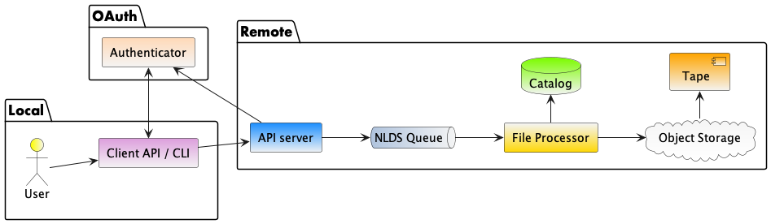
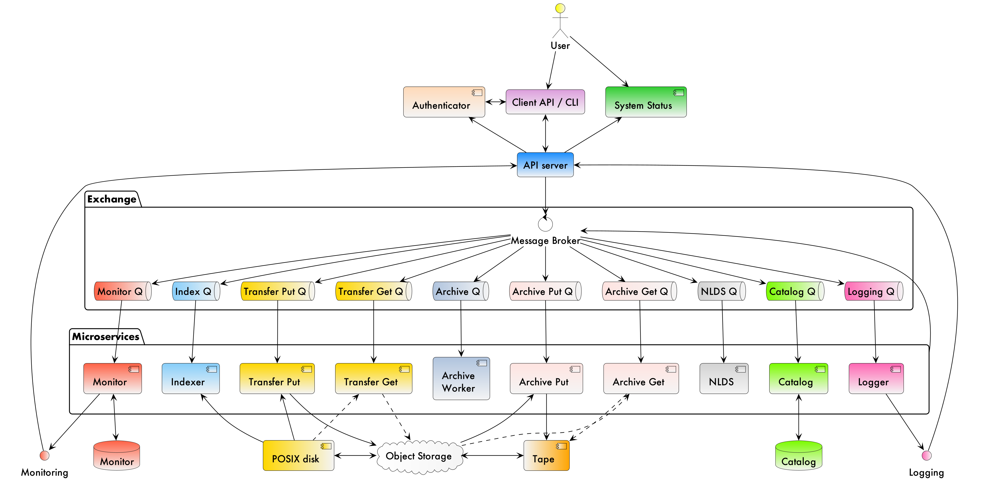
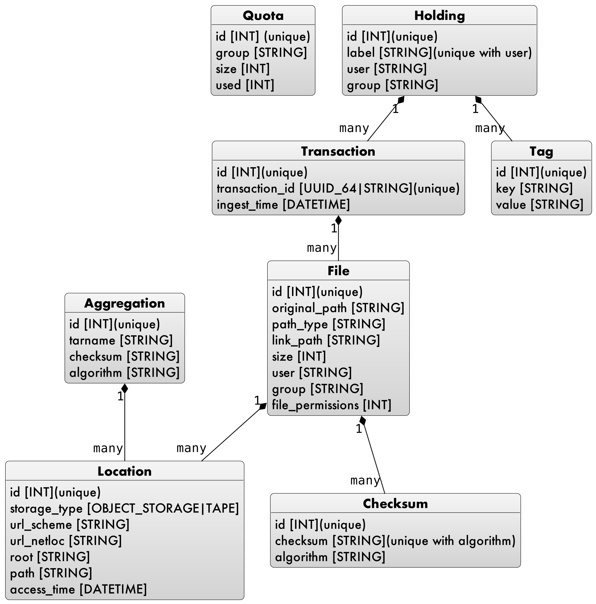

A SCALABLE NEAR-LINE STORAGE SOLUTION FOR VERY BIG DATA
=======================================================

*Neil Massey*:sup:`1`
*Jack Leland*:sup:`1`
*Bryan Lawrence*:sup:`2`

1: Centre for Environmental Data Analysis, RAL Space STFC Rutherford Appleton Laboratory, Chilton, Didcot, UK. and National Centre for Atmospheric Science, UK.

2: Departments of Meteorology and Computer Science, University of Reading, Reading, UK. and National Centre for Atmospheric Science, UK.

This is an expanded version of the paper that appears in `Proceedings of the 2023 conference on Big Data from Space, Soille, P., Lumnitz, S. and Albani, S. editor(s), Publications Office of the European Union, Luxembourg, 2023, doi:10.2760/46796, JRC135493. <https://publications.jrc.ec.europa.eu/repository/handle/JRC135493>`_

.. _`sec:intro`:

Introduction
------------

The Centre for Environmental Data Analysis (`CEDA <https://www.ceda.ac.uk>`_) is a division of `RAL Space <https://www.ralspace.stfc.ac.uk/>`_, which itself is a department of the Science and Technology Facilities Council (`STFC <https://www.ukri.org/councils/stfc/>`_), a member of UK Research and Innovation (`UKRI <https://www.ukri.org>`_). CEDA is the UK data centre for environmental data and currently has over 50PB of data stored on a range of disk based storage systems. These systems are chosen on cost, power usage and accessibility via a network, and include three different types of POSIX disk and object storage. Tens of PB of additional data are also stored on tape. Each of these systems has different workflows, interfaces and latencies, causing difficulties for users of `JASMIN <https://www.jasmin.ac.uk>`_, the data analysis facility hosted and maintained by the Scientific Computing Department (`SCD <https://scd.stfc.ac.uk>`_) of STFC, and CEDA.

The Near-Line Data Store (NLDS), developed with ESIWACE2 and other funding, is a multi-tiered storage solution using object storage as a front end to a tape library. Users interact with NLDS via a HTTP API, with a Python library and command-line client provided to support both programmatic and interactive use. Files transferred to NLDS are first written to the object storage, and a backup is made to tape. When the object storage is approaching capacity, a set of policies is interrogated to determine which files will be removed from it. Upon retrieving a file, NLDS may have to first transfer the file from tape to the object storage, if it has been deleted by the policies. This implements a multi-tier of hot (disk), warm (object storage) and cold (tape) storage via a single interface. While systems like this are not novel, NLDS is open source, designed for ease of redeployment elsewhere, and for use from both local storage and remote sites.

NLDS is based around a microservice architecture, with a message exchange brokering communication between the microservices, the HTTP API and the storage solutions. The system is deployed via Kubernetes, with each microservice in its own Docker container, allowing the number of services to be scaled up or down, depending on the current load of NLDS. This provides a scalable, power efficient system while ensuring that no messages between microservices are lost. OAuth is used to authenticate and authorise users via a pluggable authentication layer. The use of object storage as the front end to the tape allows both local and remote cloud-based services to access the data, via a URL, so long as the user has the required credentials.

NLDS is a a scalable solution to storing very large data for many users, with a user-friendly front end that is easily accessed via cloud computing. This paper will detail the design, architecture and deployment of NLDS.

.. _`sec:design`:

Design Criteria
---------------

Before designing and implementing NLDS, an analysis of the previous
system, the Joint Data Migration Application (`JDMA <https://cedadev.github.io/jdma_client/>`_), was undertaken to determine its successes and
shortcomings. These were used to inform the design criteria for NLDS,
with the criteria being split into "user criteria" and "system
criteria".

.. _`sec:user_criteria`:

User criteria
~~~~~~~~~~~~~

-  User writes files to a single endpoint, agnostic as to whether the
   file will eventually reside on disk or tape.

-  User reads files with the same command, from the same endpoint, not
   knowing whether the file resides on disk or tape.

-  User interacts with NLDS via a RESTful HTTP API. File URIs are
   exposed so that they can be read by cloud services.

-  Command line client and Python libraries available for different
   levels of user.

-  Implements CRUD (Create, Read, Update, Delete), and user interactions
   are phrased in these terms.

-  Ingest and retrieval are carried out on behalf of the user, and are
   asynchronous. The user does not have to maintain a connection for the
   commands to complete.

.. _`sec:system_criteria`:

System criteria
~~~~~~~~~~~~~~~

-  User interactions are secure and authenticated.

-  Robust, no user transactions should be lost.

-  Scalable as number of users and volume of data increases.

-  No proprietary formats for data.

-  Flexible and extensible, with the potential to replace several legacy
   systems.

-  Portable, able to be installed at other institutions, not just CEDA.

-  Open Source.

.. _`user-view`:

User view and interaction
-------------------------

Users interact with NLDS via a web-server that exposes a RESTful HTTP
API (`REST <https://www.ics.uci.edu/~fielding/pubs/dissertation/top.htm>`_). A Python library is available, as well as
a command line client, which itself is built upon the Python library. As
the interface is a REST API, a user could also form their own, correct,
HTTP requests and send them to the server.

Figure 1 shows the multi-layered architecture of NLDS. The user will only be exposed to
the top two layers, being the client API (or command line program) and the API server.

   User view of the NLDS system

The first time a user interacts with the NLDS they have to go through
the authentication procedure. This uses the `OAuth2 password flow 
<https://www.oauth.com/oauth2-servers/access-tokens/password-grant/>`_
to exchange a user's username and password for a token that is used for subsequent calls to the HTTP API. This
token is stored in the user's home directory and contains a refresh
token that can be exchanged for a new token when the existing token
expires.

The user has a number of commands available to them which implement the
CRUD design requirement and also allows them to query the files they
hold on NLDS and the metadata associated with those files. These
commands are:

-  ``put`` and ``putlist``. ``put`` ingests a single file into NLDS,
   whereas ``putlist`` ingests multiple files, the paths of which are
   stored in a plain text file. This corresponds to the Create in CRUD.

-  ``get`` and ``getlist``. Retrieve a single file, or a list of files.
   This corresponds to the Read in CRUD.

-  ``del`` and ``dellist``. Delete a single file, or a list of files.
   This corresponds to the Delete in CRUD.

-  ``meta``. Update metadata for a collection of files, by adding (or
   changing) the label or tags.

-  ``list``. Show and search the collections of files that belong to the
   user.

-  ``find``. Show and search the files that belong to the user. Regular
   expressions can be used to find file paths, and the collections they
   belong to.

Implementation details
----------------------

.. _`sec:overview`:

Overview
~~~~~~~~

NLDS is built upon a number of free, open-source software technologies
in a multi-layered architecture that uses message passing to communicate
between the different layers.
Figure 2 shows
the different layers in the system and the interaction, via the
messages, between them.

   The multilayer NLDS system architecture, and the interactions between
   the different layers in the system.

.. _`sec:webserver`:

API server
~~~~~~~~~~

The NLDS HTTP API is implemented in `FastAPI <https://fastapi.tiangolo.com>`_ in Python 3, and runs in a `Uvicorn ASGI <https://www.uvicorn.org>`_ 
server. FastAPI is a Python framework for developing RESTful APIs and
was selected as the framework for NLDS for the following reasons:

-  Fully supports `Python AsyncIO <https://docs.python.org/3/library/asyncio.html>`_ for
   asynchronously dealing with user requests.

-  Automatically produces `OpenAPI <https://www.openapis.org>`_
   documentation.

-  Is quick to develop for, fast execution of queries and robust.

-  Has an easy to understand framework for developing RESTful APIs via
   the concept of routers.

-  Integrates well with OAuth2 authentication by allowing routers to be
   dependent on a function that carries out the authentication of the
   HTTP request.

NLDS's API consists of a number of endpoints which accept the standard
HTTP methods of GET, PUT, POST and DELETE, with information contained in
the header and body of the request. These endpoints, and the expected
values in the header and body, are discoverable and documented by
automatically generated OpenAPI documentation. In the Python code, each
endpoint has a router to deal with the HTTP request. Each router
performs authentication, followed by validity checking of the
information contained in the header and body and, finally, forms a
message that is then dispatched to the message broker.

.. _`sec:auth`:

Authentication and authorisation
~~~~~~~~~~~~~~~~~~~~~~~~~~~~~~~~

As mentioned in Section :ref:`user-view`, NLDS is secured using
the OAuth2 password flow. The authentication layer consists of a plug-in
architecture, with a ``BaseAuthenticator`` class, which is purely
abstract. To define an authenticator, the ``BaseAuthenticator`` must be
inherited from and three class methods must be overloaded. For the
deployment on JASMIN, a ``JasminAuthenticator`` has been written which
contacts a JASMIN accounts service that can generate and authenticate
OAuth2 tokens. Deploying NLDS to a different infrastructure will require
an authenticator for that system to be written.

In addition to the OAuth2 authentication, the object storage that NLDS
writes to and reads from also requires access credentials, in the form
of the ``access_key`` and ``secret_access_key``. These are stored in the
user’s NLDS config file, in their home directory and are embedded,
firstly, in the HTTP request sent to the API server, and then in the
message formed and sent to the message broker.

.. _`sec:catalog`:

Catalog
~~~~~~~

When a user PUTs ``files`` into NLDS, the ``files`` are recorded in a
catalog on their behalf. The user can then list which ``files`` they
have in the catalog and also search for ``files`` based on regular
expressions. Additionally, users can associate a ``label`` and ``tags``,
in the form of ``key:value`` pairs, with a collection of ``files``.

   NLDS catalog database schema

Figure 3 shows the database schema of the
catalog. It consists of several tables, each one having a relationship
to at least one other table.

**Holdings** are collections of ``files``, that the user has chosen to
group together and assign a ``label`` to that collection. A reason to
collect ``files`` might be that they are from the same experiment, or
climate model run, or measuring campaign.

A ``holding`` is created when a user PUTs ``files`` into NLDS. Users can
give the ``holding`` a ``label`` but, if they do not, a ``label``
derived from the ``id`` of the first ``transaction`` will be assigned
instead.

New ``holdings`` are created if the ``label`` does not already exist and
users can add ``files`` to an existing ``holding`` by specifying a
``label`` that does exist.

Users can add ``files`` into NLDS that already exist in the system, so
long as the ``original_path`` is unique within a ``holding``. This
allows users to use NLDS as an iterative backup solution, by PUTting
``files`` with the same ``original_path`` into differently labelled
``holdings`` at different times. GETting the ``files`` will return the
latest ``files``, while leaving the older ``files`` still accessible by
specifying the ``holding’s`` ``label``.

**Transactions** record the user’s action when PUTting a ``file`` into
NLDS. Each ``holding`` can contain numerous ``transactions`` and a
``transaction`` is created every time a user PUTs ``files`` into NLDS.

The ``transaction’s`` ``id`` is a UUID generated on the client when
submitting a request to NLDS. This UUID stays with the transaction
throughout the fulfillment of the request. Requests may be split into
multiple sub-requests, and the UUID is used to group these sub-requests
together upon completion.

The ``transaction`` is assigned to a ``holding`` based on the ``label``
supplied. If the same ``label`` is specified for a number of PUT
actions, then the ``holding`` with that ``label`` will contain all the
``transactions`` arising from the PUT actions.

**Tags** can be associated with a ``holding``, in a ``key:value``
format. For example, a series of ``holding`` could have ``tags`` with
the ``key`` as **experiment** and ``value`` as the experiment name or
number. A ``holding`` can contain numerous ``tags``, in addition to
``label``. ``Tags`` can be used for searching for ``files`` or
``holdings`` with the ``list`` and ``find`` commands.

**File** objects record the details of ``files``, including the
``original_path`` of the ``file``, its size and the ownership and
permissions of the ``file``. Users can GET ``files`` in a number of
ways, including by using just the ``original_path`` where NLDS will
return the most recent ``file`` with that path. NLDS supports different
methods of calculating ``checksums``, and so more than one ``checksum``
can be associated with a single file.

**Location** objects record the actual location of a file. A user does
not care whether a ``file`` is on the object storage, or tape, but NLDS
must know so that it can invoke the correct microservice to fetch the
``file``. The ``location`` can have one of three states:

#. The ``file`` is held on the object storage only. It will be backed up
   to the tape storage later.

#. The ``file`` is held on both the object storage and tape storage.
   Users can access the ``file`` without any staging required by NLDS.

#. The ``file`` is held on the tape storage only. If a user accesses the
   ``file`` then the NLDS will stage it to the object storage, before
   completing the GET on behalf of the user. Accessing a ``file`` that
   is stored only on tape will take longer than if it was held on object
   storage.

.. _`sec:message_broker`:

Message broker, exchange and queues
~~~~~~~~~~~~~~~~~~~~~~~~~~~~~~~~~~~

NLDS uses `RabbitMQ <https://www.rabbitmq.com>`_  as the message broker to
facilitate communication between the API server and the microservices
and communication between the microservices themselves. RabbitMQ was
chosen for this due to its maturity, flexibility, ease of use and
existing experience within the CEDA development team.

RabbitMQ has a publisher-consumer model, where one process will publish
a message to be consumed by another process. In NLDS, the API server is
the main publisher and the originator of all messages in the RabbitMQ
exchange. The NLDS worker is the main consumer and will schedule extra
messages depending on the content of the message received. The NLDS
worked can be thought of as the "marshall" or "controller". It knows the
message order that tasks have to follow and schedule the next message in
the task when a completion message is received from the previous process
in the task.

The microservices are the consumers of the messages but they are also
publishers, so that they can indicate to the NLDS when the process has
finished. This system of completion messages, and the NLDS worker
scheduling messages, allows NLDS to be stateless.

NLDS has a RabbitMQ topic exchange with a queue for each microservice. A
topic exchange uses a routing key, and queues can subscribe to accept
messages with a particular key. The routing keys for the messages have
three components: the calling application, the worker to act upon and
the state or command for the worker. These are separated by a dot
(``.``): ``application.worker.state``

The calling application part of the routing key will remain constant
throughout the operations lifecycle. This allows multiple applications
to use the worker processes without interpreting messages destined for
the other applications. NLDS uses the application key ``nlds-api``.

The worker part of the routing key is just the name of the worker, and
the state or command has, for example, the value of ``init``, ``start``,
``completed``, etc. When a queue is bound to a topic, it can use a
wildcard in the place of each dot separated part of the routing key. For
example the catalog queue contains the bindings: ``*.catalog.start`` and
``*.catalog.complete``. When a wildcard occurs, any message produced by
the consumer retains the value that the wildcard expanded to, for
example, ``nlds-api``. This is the mechanism that allows generalised
workers to send their output to the originating producer/consumer.

NLDS uses delayed retry queues. If a process fails then it will resubmit
the message to the exchange with a delay, so that it can be processed
again later. This gives the system the ability to be more fault tolerant
by retaining, and automatically retrying, messages until after a problem
with the system is fixed. There are a configurable number of retries and
the delays increase exponentially for each retry.

The asynchronous nature of the message passing means that it is
unsuitable for user interactions that require an immediate response,
such as the ``list``, ``meta`` and ``find`` commands. To facilitate
these, remote procedure calls (RPCs) are used. These are non-blocking
due to FastAPI's use of AsyncIO and so should not have a detrimental
effect on performance.

.. _`sec:microservices`:

Microservices
~~~~~~~~~~~~~

The microservices that NLDS uses to carry out users requests are
designed to be robust, minimal and scalable. Each one is designed to
perform a minimum number of tasks, related to just one aspect of NLDS.
The previous system, JDMA, was somewhat monolithic which, when a part of
the system failed, required re-running user tasks from the very
beginning. By using microservices, NLDS is interruptible and
recoverable. It is also extendable as new microservices can be written
to transfer to new storage types, or from different sites, just by
defining a routing key and implementing the microservice.

From Figure 2 the microservices are:

**NLDS**: This is the "NLDS worker" which accepts messages from the API
server and co-ordinates message passing between the other microservices.
By having a marshalling process, NLDS can remain stateless.

**Monitor**: The monitor keeps track of the progress of all
transactions, whether they are GET or PUT transactions and updates their
status in a Postgres database via the `SQLalchemy <https://www.sqlalchemy.org>`_
library. Each microservice sends a
message to the monitor at the start and end of the task it is
undertaking. Users can then query the progress of their task using the
``stat`` command, upon which the API server contacts the monitor via a
RPC call, which reports the status of a transaction to the user.

**Logger**: The logger is distinct from the monitor in that it is
concerned with logging the state of the NLDS system, rather than the
state of the user transactions in NLDS.

**Indexer**: This builds lists of files based on the filepath or file
list supplied by the user in a PUT request. This filepath (or multiple
filepaths in a file list) may be a directory, or contain a wildcard. The
indexer expands these to build a list of files that should be PUT into
NLDS. To maintain recoverability, the indexer will split requests into
sub-requests based on number of files and sum of file sizes. When an
index process has reached a (configurable) maximum number of files or
sum of file sizes, it will break from indexing and submit a new message
to the exchange to continue indexing where it left off. The
``transaction id`` is maintained across the sub-requests so that NLDS
can group them together in the cataloging stage. Splitting requests like
this means that the transfer process, and subsequently the archive
process, will have smaller batches of files to transfer and will be more
recoverable from faults.

**Transfer**: This transfers the files from POSIX disk to object
storage, using the standard S3 transport protocol. Currently the `min.io <https://min.io/docs/minio/linux/developers/python/minio-py.html>`_
Python library is used, but the `Amazon botocore <https://botocore.amazonaws.com/v1/documentation/api/latest/index.html>`_ library could be substituted.

**Archiver**: This writes files from object storage to tape by directly
streaming, using the `xrootd <https://xrootd.slac.stanford.edu>`_ protocol. The
tape system used is the Cern Tape Archive (`CTA <https://cta.web.cern.ch/cta/>`_).
All files in the object store are written to tape shortly after
ingestion.

**Catalog**: This writes and retrieves the details of a users files to
the catalog database. `SQLalchemy <https://www.sqlalchemy.org>`_ is used
to define the database schemas and carry out the queries.

.. _`sec:policies`:

Management of object storage
~~~~~~~~~~~~~~~~~~~~~~~~~~~~

It is inevitable that the object storage used by NLDS will become full.
To mitigate this, NLDS has a number of policies that determine which
files should be deleted from the object storage, while remaining on
tape. These policies are expressed in terms of the last access, the file
size, any substrings contained in the holding name, and any tags present
in the holding.

If a user requests a file that has been deleted from the object storage
then it will be retrieved from tape, staged on the object storage and
then copied to the target directory that the user requested. This is
done by issuing the same command, and the only difference the user will
notice is the extra time the request will take to complete. Requests are
handled asynchronously, so it will not tie up their session by blocking.
They can check the progress of the request using the ``stat`` command.

.. _`sec:deployment`:

Deployment
----------

NLDS is currently deployed on JASMIN hosted at the STFC
Rutherford-Appleton Lab, with users from CEDA, JASMIN and the JASMIN
user community conducting beta tests. The deployment uses a mixture of
free, open-source technology:

The **API server** is deployed in a `Docker <https://www.docker.com>`_
container within a load-balanced `Kubernetes <https://kubernetes.io>`_
orchestration on JASMIN.

The **microservices** are deployed in Docker containers that are
orchestrated by Kubernetes. This allows more instances of a microservice
to be "spun-up" when necessary.

The **monitor and catalog databases** are running on a dedicated, bare
metal `PostgreSQL <https://www.postgresql.org>`_ server.

The JASMIN accounts **authenticator** and the **RabbitMQ** server are
running on Virtual Machines (VMs), hosted on JASMIN.

**Object storage** is provided by `DataCore Swarm <https://www.datacore.com/products/swarm-object-storage/>`_, but any S3 compatible object storage could
be used.

The **tape system** is the Cern Tape Archive (`CTA <https://cta.web.cern.ch/cta/>`_).

.. _`sec:conclusion`:

Conclusion
----------

This paper has described a new scalable near-line storage solution that
is robust, scalable, extendable, user-friendly and secure. The Near-Line
Data Store (NLDS) is currently in beta test, with a roll out to more
users of JASMIN planned for later in the year. An extensive user guide
and tutorial can be found at `nlds-client <https://cedadev.github.io/nlds-client/>`_

Acknowledgement
---------------

NLDS was supported through the ESiWACE2 project. The project ESiWACE2 has received funding from the European Union's Horizon 2020 research and innovation programme under grant agreement No 823988.

.. image:: ../_images/esiwace2.png
   :width: 300
   :alt: ESiWACE2 Project Logo

.. image:: ../_images/ceda.png
   :width: 300
   :alt: CEDA Logo