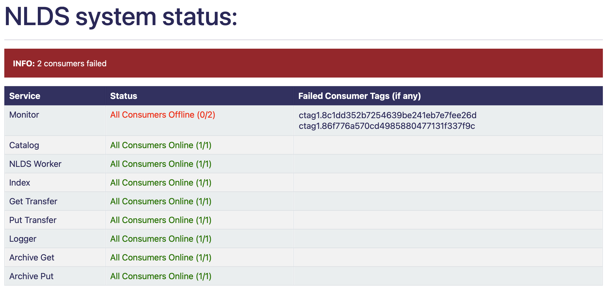

The System Status Monitor
==========================


This is a feature used to check the general health of the various parts of the NLDS, telling you which parts, if any, of the NLDS are currently offline as well as the IDs of any offline consumers. First, some definitions:

* A microservice is a distinct part of the NLDS structure e.g.: Monitor, Catalog, Index, etc. It will have a single queue.
* A consumer is a part of a microservice, which takes messages off the queue and processes them. There can be many consumers per microservice.

This utilises the RabbitMQ messaging system, and specifically its capacity for remote procedure calls, to send messages to individual microservice consumers and check whether they reply. If they don't reply within a given time limit they are considered to be offline and their unique tag is recorded and displayed on the table to easily determine what is working and what isn't. 


Given these messages are merely sent for monitoring purposes, they are made distinct from regular NLDS rabbit messages with the below changes. This distinction is made in the  dictionary content that is passed as part of the message::

    {
        "details": {
            "api_action": "system_stat", 
            "target_consumer": "", 
            "ignore_message": False
        }
    }

* api_action contains "system_stat" which is the identifier that tells the consumer that 
  it is a test message
* target_consumer starts as empty and is filled with the target microservice's name e.g: monitor
* ignore_message is by default False, and is used within unit tests to mock what happens if one of the consumers does not respond. 
  

The consumer will, as a first step in consumption, filter all incoming messages for this distinction and send it back to the system status monitor. The message returned by the consumer is as follows::

    {
        'details': {
            'api_action': 'system_stat', 
            'target_consumer': 'monitor', 
            'ignore_message': False
        }, 
        'timestamp': '2023-08-01-09:25:12.968165'
    }


|

Running
-------


After starting the uvicorn server, going to ```/system/stats/``` on a web browser e.g.: <http://nlds.ceda.ac.uk/system/stats/> will simply return the whole table with information about each consumer. The contents of this table and web page are also available as a JSON document, through the API. To get the more specific information about a particular consumer, it is possible to make individual requests to the API server (e.g. using `requests.get()` from a python script).


Query parameters can be used to alter behaviour. Adding ?time_limit={number} to the end of the URL will change the time limit the consumer has to reply (more on that below) e.g.:
<http://nlds.ceda.ac.uk/system/status/?time_limit=2>

You can also add ?microservice={microservice} to the end of the URL to get a table with only
those microservices in. e.g. (shows a table with only the monitor row):
<http://nlds.ceda.ac.uk/system/status/?microservice=monitor>

These 
?time_limit=2&microservice=Catalog&microservice=Monitor 
e.g.:
<http://nlds.ceda.ac.uk/system/status/?time_limit=2&microservice=Catalog&microservice=MonITor&microservice=2&microservice=INdeX&microservice=catalog&time_limit=2&time_limit=2&microservice=logger&>
this link does actually work even though it looks very confusing it will set the time limit to 2 and open a table with catalog, monitor, index and logger rows
and would look like this:

.. image:: _images/status/short_table.png
    :width: 400
    :alt: short table

Adding these options is not necessary for the web page to work but it adds customisability.


|

Understanding the table
-----------------------


When you open the webpage, it will load quickly unless some consumers have failed. 
This is because the system will wait the duration of the time limit (hard coded in the files), 
the default for this is 5 seconds but it can be changed by adding ?time_limit={number} at the end of the URL. This 
number cannot go below 0 or above 15 otherwise it defaults to 5 seconds.

You are also able to select specific microservices and get a JSON response from them 
helpful for an API. To do this add the microservice you want at the end of the URL
<http://nlds.ceda.ac.uk/system/status/catalog>
this will give information as a JSON response for the catalog microservice you can also add time limit to this like the others:
<http://nlds.ceda.ac.uk/system/status/catalog?time_limit=6>
(this shows catalog JSON information with a time limit as 6). This uses the same rules as 
the other time limit (not below 0 or above 15). If you spell the microservice wrong, then
it will take you to the main table.

an example template JSON response would be::
    
    {
        "microservice_name":{microservice name},
        "total_num":{number of consumers},
        "num_failed":{number of failed consumers},
        "num_success":{number of successful consumers},
        "failed_list":[],
        "pid": {process ID},
        "hostname": {microservice host name}
    }

and an example of a full JSON response would be::

    {
        "microservice_name":”monitor”,
        "total_num":0,
        "num_failed":0,
        "num_success":0,
        "failed_list":[],
        "pid": 3873,
        "hostname": “RSMLWC01”
    }


|

On the main table you will see 3 columns as well as an info bar above,
the info bar will give you a summary of the table's information.


1.  the left most table column holds all 7 NLDS microservices
2.  the middle column will say how many consumers in each microservice is running
    (and change colour depending on that number)
3.  the right most column will display the tag of any or all consumers that failed
    to be ran

There's one tag for each consumer running on a given microservice. This tag can be used to determine which (if any) have stopped working.


The table should look something like this (with examples of different status):
    =============  =========================================  =========================================
    Service        Status                                     Failed Consumer Tags (if any)
    =============  =========================================  =========================================
    Monitor        All Consumers Offline (None running)
    Catalog        All Consumers Online (3/3)
    NLDS Worker    Consumers Online (1/2)                     ctag1.732d21f82b4c47dcbd7dabe12f95315c
    Index          Login error
    Get Transfer   404 error
    Put Transfer   Rabbit error
    Logger         All Consumers Offline (0/2)                ctag1.732d21f82b4c47dcbd7dabe12f95315c
    Logger         (the ctag here will be on the row above)   ctag1.040535d3708c4012a4d2e6b0e6884cf2
    Archive Get    All Consumers Online (1/1)
    Archive Put    All Consumers Online (4/4)
    =============  =========================================  =========================================

The errors on Index, Get Transfer and Put Transfer are for illustrative purposes and are not accurate 
representations of what the whole table will look like.

|

**System status example tables:**

When no consumers are running, the info bar is blue, and the status text is red.

.. image:: _images/status/all_off.png
  :width: 600
  :alt: All consumers off
|
When all consumers inside a microservice are offline the info bar is red as well as the status column text for the offline microservice. The working microservices status text is green.


|
When some consumers inside a microservice are offline the info bar is red 
the partially failed microservice's status text is orange.

.. image:: _images/status/part_failed.png
  :width: 600
  :alt: some consumers failed
|
When all consumers online the info bar is green, there is nothing in failed consumer column and all status text is green.

.. image:: _images/status/success.png
  :width: 600
  :alt: All consumers on

|

We get the number of consumers that should be online by an HTTP request to the management API which returns a response containing a dictionary of all consumers in a specific microservice this is counted and used as the total consumers. 

Using this URL format:
http://{host_ip}:{api_port}/api/queues/{vhost}/{queue_name}

* host_ip = the ```server``` variable from the RabbitMQ section of the config file
* api_port = the ```admin_port``` variable from the RabbitMQ section of the config file
* vhost = the ```vhost``` variable  from the RabbitMQ section of the config file
* queue_name = the name of the microservice to get information for

For more information go to https://www.rabbitmq.com/management.html#http-api

|

Responses
---------


What is returned to the HTML template is a dictionary that could be retrieved using an
API. This is its structure::

    {
        "monitor": monitor,
        "catalog": catalog,
        "nlds_worker": nlds_worker,
        "index": index,
        "get_transfer": get_transfer,
        "put_transfer": put_transfer,
        "logger": logger,
        "archive_get": archive_get,
        "archive_put": archive_put,
        "failed": failed_info
    }

Where the variables for each of the microservices, which gives information to the table on the webpage, would be::

    {
        "val": {number of consumers online}, 
        "colour": {string colour}, 
        "failed": {failed consumer tags}
    }

* val = a string with how many consumers there are and how many are online (e.g.: 2/3)
* colour = the colour that is used to colour the text in the HTML (e.g.: ORANGE)
* failed = a list of failed consumer tags populated only if at least one consumer has failed (e.g.: ctag1.87eb99d764be459d88f673cd8eb438da)


And the value of failed_info, which gives information to the INFO bar on the webpage, would be::
    
    {
        "failed_num": num,
        "failed_colour": colour
    }

* num = the total number of failed consumers across all microservices
* colour = HTML code string used to colour the INFO box e.g.: alert-info (turns the INFO box blue)

|

Errors
------


The page may not always work properly.
This can include but is not limited to:

1.  The uvicorn server is not running (page will not load)
2.  The RabbitMQ server is down (the Status says ```Rabbit error```)
3.  The HTTP request has failed (the Status says ```Failed to make request```) or you have the wrong port in the ```admin_port``` section of the config file :doc:'server-config/server-config'
4.  If the RabbitMQ login information in the .server_config file is incorrect
    (the Status says ```Login error```)
5.  If there was an error that didn't get caught in the code then the request.get response is displayed on the table in JSON format, for example it could display {'error': 'Object Not Found', 'reason': 'Not Found'}

|

TL;DR
-----


going to ```/system/status/``` on a search engine or <http://nlds.ceda.ac.uk/system/status/>
will show you a table of what microservices are currently running and the tags of any consumers that have failed.
