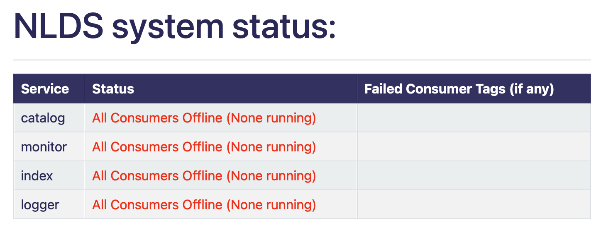
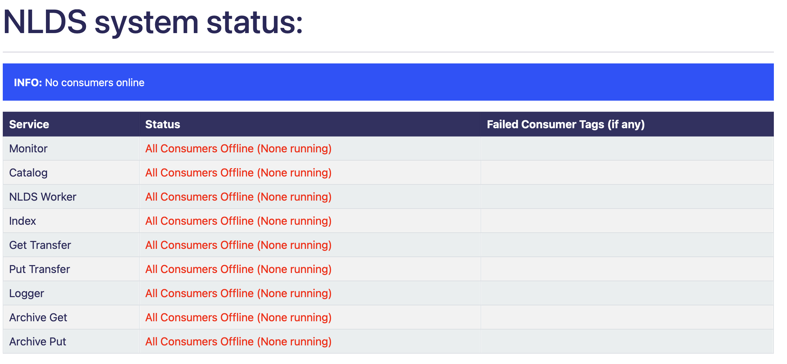
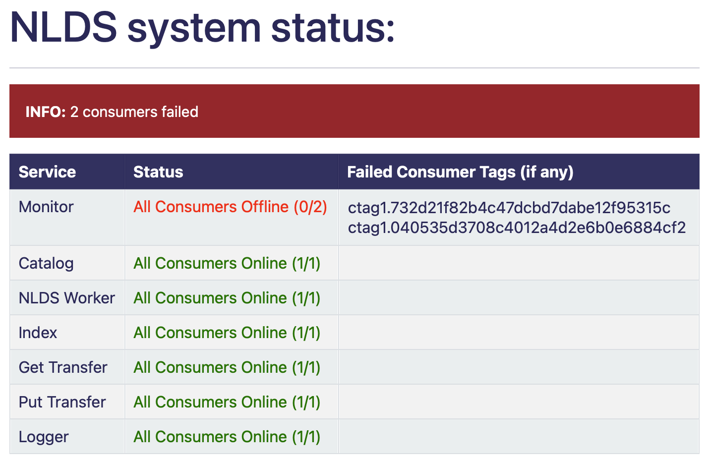
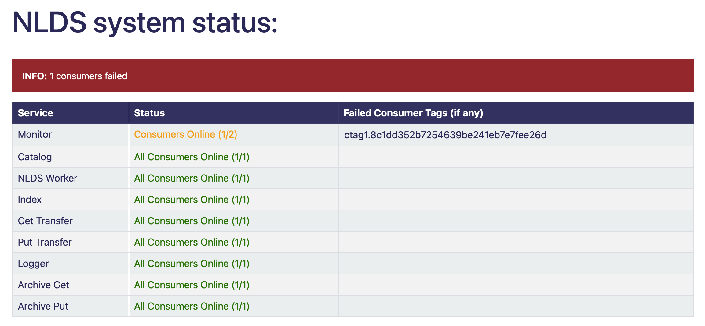
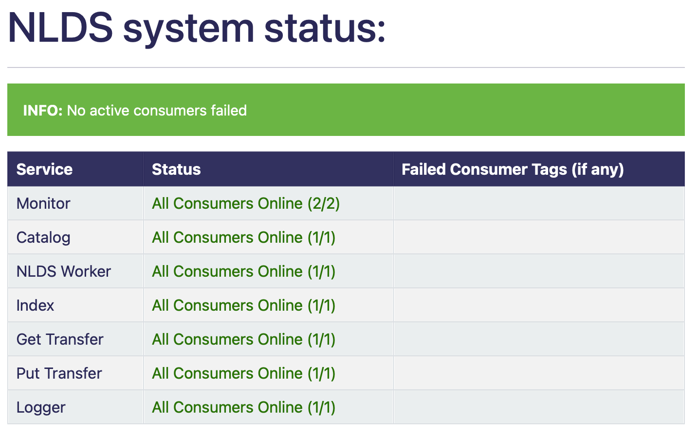

Using System Status
===================


This is a way of checking which parts of the NLDS are currently online
and which are offline as well as the IDs of any offline consumers.

* A microservice is a part of the NLDS queues e.g: Monitor, Catalog, Index, etc..
* A consumer is part of the microservice there can be many consumers per microservice

This was created because there wasn't originally an easy way to view if any part of the NLDS was
offline.

This was made by using the RabbitMQ messaging system to send messages to individual
microservice consumers to check if they reply or not. These messages only contain a distinction 
that it is being used for a test. If the consumer detects this distinction they will reply
and then stop so it doesn't confuse the consumer with a test message.

If they reply they will be marked as online, if they don't or are too slow they are 
considered to be offline and their unique tag is recorded and displayed on the table 
to easily determine what is working and what isn't.


This distinction is inside the msg_dict dictionary that is passed in the message::

    {
        "details": {
            "api_action": "system_stat", 
            "target_consumer": "", 
            "ignore_message": False
        }
    }

* api_action contains "system_stat" which is the identifier that tells the consumer that 
  it is a test message
* target_consumer starts as empty and is filled with the target microservice's name e.g: monitor
* ignore_message is by default False, this is used to mock what happens if one of the consumers did not respond. 
  It is automatically changed in the code if it is being tested

What is returned by the consumer is what is returned when a regular, non- `system_stat` message is sent::

    {
        'details': {
            'api_action': 'system_stat', 
            'target_consumer': 'monitor', 
            'ignore_message': False
        }, 
        'timestamp': '2023-08-01-09:25:12.968165'
    }

The only difference between this published message and a normal one is the msg_body, 
which contains the details dictionary distinguishing it from other messages


|

Running
-------


After the uvicorn server is running go to ```/system/stats/``` on a web browser
e.g: <http://127.0.0.1:8000/system/stats/> if running a local server.

This simply returns the whole table with information about each consumer. The 
contents of this table and web page are also available as a json document, through 
the API. To get the more specific information about a particular consumer, it is 
possible to make individual requests to the API server (e.g. using `requests.get` 
from a python script).


Adding ?time_limit={number} to the end of the URL will change the time limit 
(more on that below) e.g:
<http://127.0.0.1:8000/system/status/?time_limit=2>

You can also add ?consumer={microservice} to the end of the url to get a table with only
those microservices in. e.g (shows a table with only the monitor row):
<http://127.0.0.1:8000/system/status/?consumer=monitor>

You can string both together by doing this: 
?time_limit=2&consumer=Catalog&consumer=Monitor

e.g:
<http://127.0.0.1:8000/system/status/?time_limit=2&consumer=Catalog&consumer=MonITor&consumer=2&consumer=INdeX&consumer=catalog&time_limit=2&time_limit=2&consumer=logger&>
(this link works and will set the time limit to 2 and open a table with catalog, monitor, index and logger rows)
and would look like this:



This is not necessary for the web page to work but it adds customisability.


|

Understanding the table
-----------------------


When opening the page it will load quickly unless some consumers have failed. 
This is because the system will wait the duration of the time limit set in system.py, 
the default for this is 5 seconds but can be changed by changing the value of time_limit. 
It can also be changed by adding ?time_limit={number} at the end of the URL. This 
number cannot go below 0 or above 15 otherwise it defaults to 5 seconds.

You also have the choice to select which microservices you want to see specifically 
by adding ?consumer={microservice} at the end of the URL. you can string as many of these as
you want and it will show your options. If you spell it wrong it will not break but ignore it
and if you accidentally have a duplicate it will ignore that also. Doing ?consumer=all which will show the regular table.

You are also able to select specific microservices and get a JSON response from them 
helpful for an API. To do this add the microservice you want at the end of the URL
<http://127.0.0.1:8000/system/status/catalog>
this will give information as a JSON response for the catalog microservice
you can also add time limit to this like the others:
<http://127.0.0.1:8000/system/status/catalog?time_limit=6>
(shows catalog JSON information with a time limit as 6). This uses the same rules as 
the other time limit (not below 0 or above 15). If you spell the microservice wrong then
it will take you to the main table.

an example JSON response if the microservice consumers weren't running would be::
    
    {
        "microservice_name":"catalog",
        "total_num":0,
        "num_failed":0,
        "num_success":0,
        "failed_list":[],
        "pid":process ID,
        "hostname":microservice host name
    }

You will see a table with 3 columns as well as an info bar above
the info bar will give you a summary of the tables information.


1.  the left most table column holds all 7 NLDS microservices
2.  the middle column will say how many consumers in each microservice is running
    (and change colour depending on that number)
3.  the right most column will display the tag of any or all consumers that failed
    to be ran


One consumer tag links to an individual consumer for a microservice for example if you 
run ```nlds_q``` on 3 different terminals then you will have 3 consumers for the NLDS Worker
microservice each of these consumers will have their own tag that can be used to determine 
which (if any) have stopped working.


The table should look something like this (with examples of different status):
    =============  =========================================  =========================================
    Service        Status                                     Failed Consumer Tags (if any)
    =============  =========================================  =========================================
    Monitor        All Consumers Offline (None running)
    Catalog        All Consumers Online (3/3)
    NLDS Worker    Consumers Online (1/2)                     ctag1.732d21f82b4c47dcbd7dabe12f95315c
    Index          Login error
    Get Transfer   403 error
    Put Transfer   Rabbit error
    Logger         All Consumers Offline (0/2)                ctag1.732d21f82b4c47dcbd7dabe12f95315c
    Logger         (the ctag here will be on the row above)   ctag1.040535d3708c4012a4d2e6b0e6884cf2
    =============  =========================================  =========================================

The errors on Index, Get Transfer and Put Transfer are for illustrative purposes and are not accurate 
representations of what the whole table will look like.

|

**possible examples of how the system status table can look:**

No consumers are running. Blue info bar. All text is red.


|
All consumers inside a microservice are offline. Red info bar and all failed tags in the row. 
the failed text is red, the rest is green.


|
Some consumers inside a microservice are offline. Red info bar and all failed tags in the row. 
the partially failed microservice is in orange.


|
All consumers online. Green info bar nothing in failed consumer column. all text in green.



|

We get the number of consumers that should be online by using the requests python package
which returns a response containing a dictionary of all consumers in a specific microservice 
this is counted and used as the total consumers. 

|

responses
---------


What is returned to the HTML template is a dictionary that could be retrieved using an
API. This is its structure::

    {
        "monitor": monitor,
        "catalog": catalog,
        "nlds_worker": nlds_worker,
        "index": index,
        "get_transfer": get_transfer,
        "put_transfer": put_transfer,
        "logger": logger,
        "failed": failed_info
    }

Where the variables for the microservices will be::

    {
        "val": "Consumers Online 2/3", 
        "colour": "ORANGE", 
        "failed": consumers_fail
    }

* val = a string with how many consumers there are and how many are online
* colour = the colour that is used to colour the text in the HTML
* failed = a list of failed consumer tags (only exists if at least one consumer has failed)


Where the value of failed_info is::
    
    {
        "failed_num": num,
        "failed_colour": colour
    }

* num = the total number of failed consumers across all microservices
* colour = HTML string used to colour the INFO box

|

Errors
------


There may be some times when this page doesn't work properly.
This can include but is not limited to:

1.  The uvicorn server is not running (page will not load)
2.  The RabbitMQ server is down (the Status says ```Rabbit error```)
3.  The requests package HTTP request has failed (the Status says ```403 error```) or you have the wrong
    port in the admin port section of the config file
4.  If you have put in invalid login information into .server_config
    (the Status says ```Login error```)
5.  If there is an unexpected error with the requests return then the code will
    catch it and show the json value of what was returned under the Status


If the RabbitMQ server is down, after it is back up then ```logging_q``` needs to be ran 
first in order for other microservices to work. Even if most of the RabbitMQ server is down, 
if only api_queues is down then the python requests package will not be able to find 
the object and therefore a Rabbit error will occur. This is because it will return::
    
    {'error': 'Object Not Found', 'reason': 'Not Found'}

|

TL;DR
-----


going to ```/system/status/``` on a search engine or <http://127.0.0.1:8000/system/status/>
will show you a table of what microservices are currently running and the tags of any consumers 
that have failed