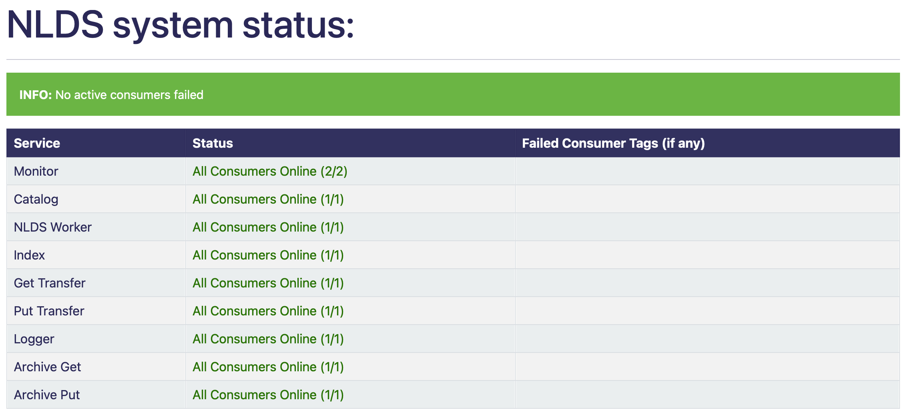

Using System Status
===================


This is a way of checking which parts of the NLDS are currently online
and which are offline as well as the IDs of any offline consumers.

This was created because there wasn't originally an easy way to view if any part of the NLDS was
offline.

This was made by using the Rabbits messaging system to send messages to individual
Service consumers to check if they reply or not. These messages only contain a distinction 
that it is being used for a test. If the consumer detects this distinction they will reply
and then stop so it doesn't confuse the consumer with a test message.

If they reply they will be marked as online,if they don't or are too slow they are 
considered to be offline and their unique tag is recorded and displayed on the table 
to easily determine what is working and what isn't.


Running
-------


After the uvicorn server is running go to ```/system/stats/``` on a search engine
e.g: http://127.0.0.1:8000/system/stats/

This is the only step their is and there is nothing to configure.


Understanding
-------------


When opening the page it will load quickly unless some consumers have failed. 
This is because the system will wait the duration of the time limit set in system.py
the default for this is 5 seconds but can be changed by changing the value of time_limit.

You will see a table with 3 columns as well as an info bar above
the info bar will give you a summary of the tables information.


1.  the left most table column holds all 7 NLDS services
2.  the middle column will say how many consumers in each service is running
    (and change colour depending on that number)
3.  the right most column will display the tag of any or all consumers that failed
    to be ran


One consumer tag links to an individual consumer for a service for example if you 
run ```nlds_q``` on 3 different terminals then you will have 3 consumers for the NLDS Worker
service each of these consumers will have their own tag that can be used to determine 
which (if any) have stopped working.


The table should look something like this (with examples of different status):
    =============  =========================================  =========================================
    Service        Status                                     Failed Consumer Tags (if any)
    =============  =========================================  =========================================
    Monitor        All Consumers Offline (None running)
    Catalog        All Consumers Online (3/3)
    NLDS Worker    Consumers Online (1/2)                     ctag1.732d21f82b4c47dcbd7dabe12f95315c
    Index          All Consumers Online (3/3)
    Get Transfer   403 error
    Put Transfer   Rabbit error
    Logger         All Consumers Offline (0/2)                ctag1.732d21f82b4c47dcbd7dabe12f95315c
    Logger         (the ctag here will be on the row above)   ctag1.040535d3708c4012a4d2e6b0e6884cf2
    =============  =========================================  =========================================

The errors on this table will most likely cause the whole table to have the same
error this is just a representation.


**possible examples of how the system status table can look:**


.. image:: status_images/failed.png
  :width: 400
  :alt: A consumer failed
.. image:: status_images/part_failed.png
  :width: 400
  :alt: some consumers failed



We get the number of consumers that should be online by using the requests.get API 
which returns a response containing a dictionary of all consumers in a specific service 
this is counted and used as the total consumers. 


responses
---------


What is returned to the HTML template is a dictionary that could be retrieved using an
API. This is its structure::

    {
        "monitor": monitor,
        "catalog": catalog,
        "nlds_worker": nlds_worker,
        "index": index,
        "get_transfer": get_transfer,
        "put_transfer": put_transfer,
        "logger": logger,
        "failed": failed_info
    }

Where the variables for the services will be::

    {
        "val": "Consumers Online 2/3", 
        "colour": "ORANGE", 
        "failed": consumers_fail
    }

* val = a string with how many consumers there are and how many are online
* colour = the colour that is used to colour the text in the HTML
* failed = a list of failed consumer tags (only exists if at least one consumer has failed)


Where the value of failed_info is::
    
    {
        "failed_num": num,
        "failed_colour": colour
    }

* num = the total number of failed consumers across all services
* colour = HTML string used to colour the INFO box


Errors
------


There may be some times when this page doesn't work properly.
This can include but is not limited to:

1.  The uvicorn server is not running (page will not load)
2.  The rabbits server is down (the Status says ```Rabbit error```)
3.  The requests API has failed (the Status says ```403 error```)


If the Rabbit server is down, after it is back up then ```logging_q``` needs to be ran
first in order for other services to work.