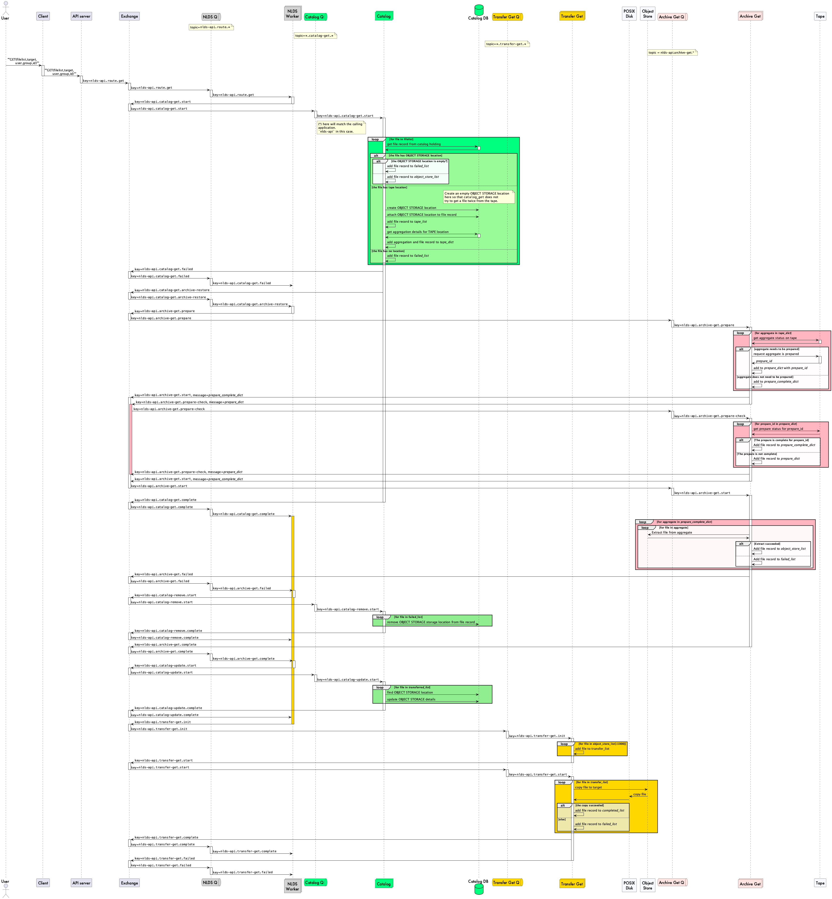
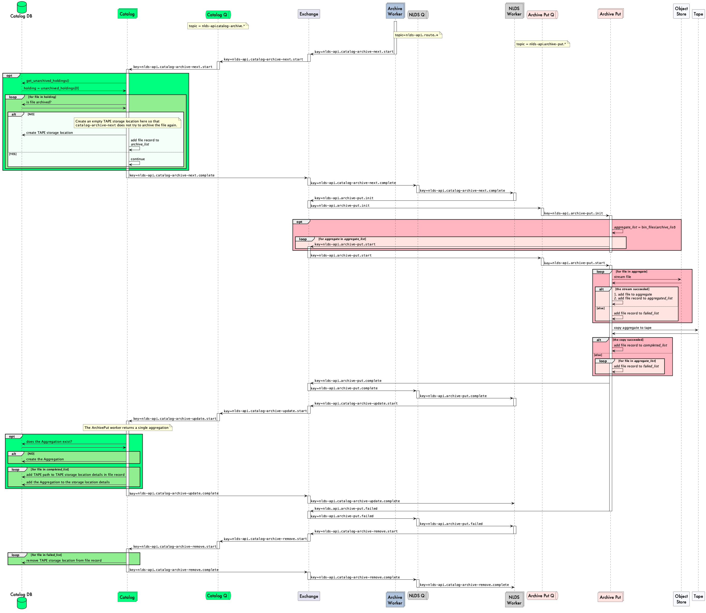

Near Line Data Store (NLDS)
===========================

# Software specification
**Neil Massey 02/11/2021 -> 29/09/2022**

# Introduction

As a successor to the Joint Data Migration Application (JDMA), a new storage 
solution is proposed.  This is based on the idea of hot, warm and cold storage:

* hot  = POSIX disk, or SSD.  Expensive in cost and power requirements.
* warm = Object Storage.  Less expensive in cost and power requirements.
* cold = Tape.  Cheapest in cost and power requirements.

(This is all "in theory" costing.)

The main idea is that users are presented with a single (and simple) 
application or API, that follows the CRUD (create, read, update, destroy) 
mnemonic.  Users can issue commands to POST a list of files (a list may 
contain exactly one file), GET a list of files, DELETE a list of files and PUT 
a list of files (update).

This can be via the command line client, or the API that the CLI is built 
upon.  Users issue a transfer command and the NLDS system performs the 
transfer on their behalf.  For example:

```nlds put <file>```

puts a single file onto the NLDS system.

```nlds putlist <filelist>```

will open the `<filelist>` file, read the file names out of the file and put
those files onto the NLDS.

There are equivalent `nlds get <file>` and `nlds getlist <filelist>` files.  
Also, we will have to support `nlds del <file>` and `nlds dellist <filelist>` 
commands.

Eventually, we will add monitoring commands as well.

To overcome some of the problems we had with the JDMA, we propose that the 
NLDS architecture has a "micro-services" setup.  This consists of:

1.  An API server, that clients connect to and issue commands to.  The commands are, as above, the CRUD commands: `put`, `putlist`, `get`, `getlist`, `del`, `dellist`.
2.  A message-broker queue.  The API server translates the user's commands to messages and pushes them onto the message-broker queue.
3.  Micro-service subscribers to the queue.  These micro-services take a message from the queue, perform a task that is encoded in the message, and then push the results back onto the queue for further action.
4.  A transfer processor.
5.  A monitoring and notification system.
6.  A catalogue database, containing the NLDS holdings.

This basic architecture is shown in Figure 1:

|  |
:-:
| **Figure 1** High-level deployment diagram of NLDS. |

# Use cases

## Group Workspace Tape Management

**Purpose**: A group workspace is an allocation of storage to a user or group 
of users (a project) on JASMIN.  It can use different storage media. There is 
a quota for each media type.

**Actors:**
1. GWS user
2. GWS Manager
3. CEDA Archive Manager

**Entities:** 
1. GWS
2. Tape system
3. CEDA Archive

**Actions:**

* A user makes an incremental copy
* A user performs a “back-up” (full or incremental) from other storage to tape 
(the first backup is an increment on nothing)
* Someone writes to tape from Archer and then restores onto disk on JASMIN.
* A GWS user needs to make space on their GWS disk.  They write data to tape 
and then remove the data from disk that has been copied to tape.
* A user wants to discover and pull data from tape, run an analysis and then 
write their results back to tape afterwards.
* Implies metadata scraping on the way in?
* Put data into “time-limited cold storage” for limited period following 
completion of project (limit = 18 months TBC).
* Retrieve GWS data from tape ready for it to be incorporated into the CEDA 
archive via ingest process.
* GWS Manager can check overall tape usage against quota, for their GWS.

## CEDA Archive

**Purpose:** storage management for the CEDA Archive

**Actors:**
1. CEDA Archive manager

**Entities:** 
1. CEDA Archive
2. Tape system

**Actions:**
* Ingest.
* Deposit.
* Storage allocation - what data should go where (should be policy driven 
rather than list driven).
* Setting up a policy for dataset - e.g. disk-only copy with MODIS.
* Maintenance.
* Make archive copies - exact copy of what is in the archive for redundancy.
* Tidy cache copies - partial copies on performance storage.
* Recovery copies - copies with deleted and modified (Backup).
* Fixity Audit.
* Migration - copy and remove (could be archive, cache or recovery copies).
* Access (either for a download service or direct from mounted file system)
* Search
* Request data to cache copy (NLA type behaviour)

# Software components

# NLDS client

* The user interacts with the NLDS client.
* Authorisation tokens are obtained from the OAuth server.
* Commands are issued to the NLDS server, along with the authorisation tokens.
* A transaction ID is generated, which is attached to every message as they 
flow through the system.

# NLDS server

* NLDS client commands are received, along with their authorisation tokens.
* Authorisation tokens are checked with the OAuth server.
* Commands are translated to RabbitMQ commands and pushed to the queue.

## CRUD operations

These messages are sent to the NLDS server.  These consist of just 6 commands.

1. `put` : transfer a single file to the NLDS.
2. `putlist` : transfer a user-supplied list of files to the NLDS.
3. `get` : retrieve a single file from the NLDS.
4. `getlist` : retrieve a user-supplied list of files from the NLDS.
5. `del` : remove a single file from the NLDS.
6. `dellist` : remove a user-supplied list of files from the NLDS.

Each message parameters contain the necessary data to carry out the transaction
on the POSIX filesystem, object storage and tape storage:

* transaction_id : a unique identifier for each transaction, generated by the nlds client at the point of initiating the transaction.
* user : the user name, used for OAuth2 authentication as well as POSIX filesystem permissions.
* group : the group that the user belongs to and is using to carry out this transaction (users can obviously belong to multiple groups).
* tenancy : the object store tenancy to transfer data to.  This will probably have a default, but the flexibility to PUT / GET data to / from different tenancies might be useful.
* access_key : the user's access key for the object storage
* secret_key : the user's secret key for the object storage

** NOTE ** it is unsatisfactory sending the access_key and secret_key in the parameters, even over HTTPS.  We will probably instigate a service that will exchange a user token for the access key at the point of transfer, using OAuth2.
This will require adding the interface to do so to the object storage.

### PUT command

| API endpoint | /files |
|---|---|
| HTTP method  | PUT |
| Parameters   | transaction_id |
|              | user |
|              | group |
|              | filepath |
|              | tenancy |
|              | access_key |
|              | secret_key |
| Body         | none |
| Example      | `/files/put?transaction_id=1;user="bob";group="root";filepath="myfile.txt"` |

### PUTLIST command

The `PUT

| API endpoint | /files |
|---|---|
| HTTP method  | PUT |
| Parameters   | transaction_id |
|              | user |
|              | group |
|              | tenancy |
|              | access_key |
|              | secret_key |
| Body         | JSON |
| Example      | `PUT /files/transaction_id=1;user="bob";group="root"`|
| Body example | `{"filepath" : ["file1", "file2", "file3"]}`|


### GET command

| API endpoint | /files |
|---|---|
| HTTP method  | GET |
| Parameters   | transaction_id |
|              | user |
|              | group |
|              | filepath |
|              | tenancy |
|              | access_key |
|              | secret_key |
| Body         | none |
| Example      | `GET /files/transaction_id=1;user="bob";group="root";filepath="myfile.txt"` |

### GETLIST command

| API endpoint | /files/getlist |
|---|---|
| HTTP method  | PUT |
| Parameters   | transaction_id |
|              | user |
|              | group |
|              | tenancy |
|              | access_key |
|              | secret_key |
| Body         | JSON|
| Example      | `/files/getlist?transaction_id=1;user="bob";group="root";`|
| Body example | `{"filepath" : ["file1", "file2", "file3"]}`|

### DEL command

| API endpoint | /files |
|---|---|
| HTTP method  | DELETE |
| Parameters   | transaction_id |
|              | user |
|              | group |
|              | filepath |
|              | tenancy |
|              | access_key |
|              | secret_key |
| Body         | none |
| Example      | `/files/transaction_id=1;user="bob";group="root";filepath="myfile.txt" `|

### DELLIST command

| API endpoint | /files/dellist |
|---|---|
| HTTP method  | PUT |
| Parameters   | transaction_id |
|              | user |
|              | group |
|              | tenancy |
|              | access_key |
|              | secret_key |
| Body         | JSON|
| Example      | `/files/dellist?transaction_id=1;user="bob";group="root"`|
| Body example | `{"filepath" : ["file1", "file2", "file3"]}`|

## OAuth server

* Performs generation and authorisation of tokens
* Currently JASMIN accounts portal.  Should be able to be something else as 
well.

The interaction of the NLDS client, NLDS server, OAuth server and the ingest of the Rabbit MQ queue is shown in Figure 2.

|  |
:-:
| **Figure 2** Interaction of NLDS client, server, OAuth server and Rabbit MQ message broker. |

# Rabbit MQ Exchange

The Rabbit MQ system consists of an Exchange, with a number of Topic Queues 
with a subscriber to each topic queue.
These are:
* Work processor
* File / directory indexer / scanner
* Transfer processor
* Database processor
* Monitor

## Messaging

The NLDS relies on passing messages between different components in the 
system.  These messages have to be formatted to match the receiving system and 
so different message formats are used:

1.  HTTP API / JSON
2.  RabbitMQ
3.  S3

## Publishers and consumers

RabbitMQ has the concept of *Publishers*, which create messages and send them to 
the exchange, and *Consumers*, which subscribe to a queue in the exchange, take 
messages from the queue and processes them.

### Publishers
The publishing of messages occurs in the NLDS web server, which is implemented
in FastAPI. The **put**, **get** and **getlist** methods in the 
*routing_methods.py* file all push messages to the RabbitMQ exchange using the
**rabbit_publish_response** method.  This uses a static instantiation of the 
**RabbitMQPublisher** class.

|  |
:-:
| **Figure 3.1** RabbitMQPublisher class|

### Consumers

All of the NLDS processors inherit the RabbitMQConsumer, which in turn inherits
the RabbitMQPublisher class.

## Rabbit MQ Exchange Structure

|  |
:-:
| **Figure 3.2** Structure and interaction of Rabbit Queues.  Not all messages are shown.  For example, both `Indexer 1` and `Indexer 2` write `work.index.complete` messages to the `Work Exchange`.|

## Message flow

### Message flow for a `putlist` command
|  |
:-:
| **Figure 4.1** Flow of messages for a `putlist` case of transferring a list of files to the NLDS.|


### Message flow for a `getlist` command
|  |
:-:
| **Figure 5.1** Flow of messages for a `getlist` case of retrieving a list of files from the NLDS. Including the case where files are only on tape|

|  |
:-:
| **Figure 6.1** Flow of messages for the internal archive worker to put unarchived files onto tape.|

## Message formats

Message content are in JSON format so as to aid human and machine readability.  
The user entry point is the NLDS server, which presents a HTTP API 
(REST-ful), implemented in FAST-API.  This HTTP API fulfills two different 
classes of operations for NLDS: the CRUD (Create, Read, Update, Delete) 
operations, and search operations. 

## Inter-process communication

Communication between processes is carried out by submitting a RabbitMQ message 
to the Exchange.  The  NLDS API server will submit the initial message into the 
Exchange.  The RabbitMQ messages consist of a routing key and a JSON document 
containing the data required to carry out the processes:

    {
        details {
            transaction_id : <string>,
            user           : <string>,
            group          : <string>,
            target         : <string>,
            tenancy        : <string>,
            access_key     : <string>,
            secret_key     : <string>
        },
        meta {
        },
        data {
        }
    }

All messages retain all parts of the `details` and `meta` fields in the JSON 
message.  This allows the details of the transaction to be passed from process to 
process, even when the process does not require some of the sub-fields in the 
`details` or `meta` fields.  The `data` field can, and will, change between each 
process.

The routing keys for the RabbitMQ messages have three components: the calling
application, the worker to act upon and the state or command for the worker.
The calling application part of the routing key will remain constant throughout
the operations lifecycle. This will allow multiple applications to use the
worker processes without interpreting messages destined for the other
applications.

`application.worker.state`

The `data` field contains the data required as input for the process and, after
processing, the output data.  For the messages detailed below in the 
#WorkerProcesses section, this consists of a single key, pair:

    data : {
        filelist       : <list<(json,int)>>
    }

The value for the `filelist` key is a `<list>` which can contain details for
multiple files.  Each `<list>` element is a `PathDetails` object, consisting of 
a `json` document and a retry `int` (see the #retries section below).
The `json` document can contain a number of key / value pairs, some of which are 
optional for each processor.  The `json` document looks like this:

    {
        file_details        : {
            original_path       : <str>,
            object_name         : <str>,
            size                : <int>, (in kilobytes?)
            user                : <str>, (get uid from LDAP?)
            group               : <str>, (get gid from LDAP?)
            file_permissions    : <int>, (unix file permissions)
            access_time         : <datetime>, (timestamp of last accessed type)
            filetype            : <str>, (LINK COMMON PATH, LINK ABSOLUTE PATH, DIRECTORY or FILE)
            link_path           : <str>, (link position,path of link, related to either root or common path)
        }
        retries             : <int>,
        retry_reasons       : <list<str>>
    }

which mostly consists of the result of a stat call on the path/file in question, 
as well as some useful metadata. The file type is included, which can be one of 
a few options: FILE, DIRECTORY, LINK.

`object_name` in the above json document refers to the name of the object once 
written to the object store. 

### Applications

* `nlds-api` - the calling API from the NLDS Fast API server
* `gws-api` - the calling API from the Group Workspace Scanner

### Workers

* `nlds` - the NLDS marshalling application.  Available only to the  `nlds-api` 
API.
* `index` - the indexer, available to the `nlds-api` and `gws-api` APIs.
* `transfer` - the file transfer, from the disk system to object storage. 
Available only to the  `nlds-api` API.

### State

These will vary between workers, but an example subset could be:

* `init`
* `start`
* `complete`

### Key processing

RabbitMQ APIs for Python, such as Pika, can retrieve the key that has bound to
a queue, even if that key contains a wildcard (`#` or `*`).  The worker
processes use this capability to form the key for the return message, keeping
the same `application` portion of the key, but appending new `worker` and / or
`state` portions.

For example, consider two different scenarios.

1. the `nlds-worker` may issue the command `nlds-api.index.start` to
the Exchange.  This will bind to the `index` queue, which has the binding
`#.index.*`.  The `Indexer` process will parse the key, replacing the `#` part
with `nlds-api` and the `*` part with `start`.  From this the `Indexer` can form
the return key of `nlds-api.index.complete`.  This will bind to the `nlds`
queue and the `nlds-worker` will interpret this message.

2. an external application, the Group Workspace Scanner issues the command
`gws-api.index.start`.  This will, as before, bind to the `index` queue, and the
`Indexer` will parse the key.  This time, the return key will be 
`gws-api.index.complete` and it will be left to the calling `gws-api` application
as to what happens next.  Note that there will be no queue in the NLDS system
that will bind to the key or interpret the message.

This is the mechanism that allows multiple applications to use parts of the NLDS
without consuming another application's messages. 

## Worker processes

The worker processes interact with each other via the Exchange and their topic 
queues.  The `NLDS` worker acts as a marshalling process - i.e. it controls the
flow of the data through the system and knows which worker to send a message to
when another worker has finished.

### NLDS

This acts as a marshalling process.  Its first action, when a new 
`nlds-api.nlds.put` message is consumed is to initiate the indexer with a 
`nlds-api.index.start` message.
The NLDS Fast API server constructs the JSON from the parameters passed in the 
URL.

#### ---> Input message

**Binding** : `nlds-api.nlds.put`

**Message** :

    {
        details : {
            transaction_id : <string>,
            user           : <string>,
            group          : <string>,
            tenancy        : <string> (optional),
            access_key     : <string>,
            secret_key     : <string>
        },
        data : {
            filelist       : <list<(json,int)>>,
        },
        meta : {
            label          : <string> (optional),
            holding_id     : <int> (optional),
            tag            : <dict> (optional)
        }
    }

The `data : {filelist : }` `json` documents contain :

    {
        file_details : {
            original_path       : <str>,
        }
    }

#### <--- Output message

**Binding** : `nlds-api.index.start`

**Message** :

    {
        details : {
            transaction_id : <string>,
            user           : <string>,
            group          : <string>,
            target         : <string> (optional),
            tenancy        : <string> (optional),
            access_key     : <string>,
            secret_key     : <string>
        },
        data : {
            filelist       : <list<(json,int)>>
        }
    }

The `data : {filelist : }` `json` documents contain :

    {
        file_details : {
            original_path       : <str>,
        }
    }

### Indexer

This takes the description of work that the Work Processor pushed onto the 
queue and starts to build a file list.

At the end it can push two different messages to the queue:
* Index a directory
* Transfer a list of files from one data storage system to another

If a threshold number of files has been reached then it can:
* Push a message to transfer the files
* Push a message to index the remainder of the directories

The file indexer fulfills three purposes:

1. It ensures that the files that the user has supplied in a filelist are actually present.
2. It recursively indexes any directories that are in the filelist.
3. It splits the filelist into smaller batches to allow for restarting the transfer, asynchronicity of transfers and allow parallel transfers.

This indexes the filelist by scanning the files to make sure they are present,
splitting up the filelist into manageable chunks and recursively scanning any
directories that are in the filelist.

`(optional)` below indicates that the Indexer does not require those subfields to
operate.  However, it should echo back any subfields that occur in the `details`
field.

`(#)` in a message below indicates that part of the key is matched to a single
word in the calling key and then the `#` in the return key is replaced with the
matched value.

#### ---> Input messages

**Binding** : `#.index.init`

**Message** :

    {
        details : {
            transaction_id : <string>,
            user           : <string>,
            group          : <string>,
            target         : <string> (optional),
            tenancy        : <string> (optional),
            access_key     : <string>,
            secret_key     : <string>
        },
        data : {
            filelist       : <list<(json,int)>>
        }
    }

The `data : {filelist : }` `json` documents contain :

    {
        file_details : {
            original_path       : <str>,
        }
    }

**Binding** : `#.index.start`

**Message** :

    {
        details : {
            transaction_id : <string>,
            user           : <string>,
            group          : <string>
            target         : <string> (optional),
            tenancy        : <string> (optional),
            access_key     : <string>,
            secret_key     : <string>
        },
        data : {
            filelist       : <list<(json,int)>>
        }
    }

The `data : {filelist : }` `json` documents contain :

    {
        file_details : {
            original_path       : <str>,
        }
    }

#### <--- Output messages

**Binding** : `(#).index.start`

**Message** :

    {
        details : {
            transaction_id : <string>,
            user           : <string>,
            group          : <string>,
            target         : <string> (optional),
            tenancy        : <string> (optional),
            access_key     : <string>,
            secret_key     : <string>
        },
        data : {
            filelist       : <list<(json,int)>>
        }
    }

The `data : {filelist : }` `json` documents contain :

    {
        file_details : {
            original_path       : <str>,
        }
    }

**Binding** : `(#).index.complete`

**Message** :

    {
        details : {
            transaction_id : <string>,
            user           : <string>
            group          : <string>
            target         : <string> (optional),
            tenancy        : <string> (optional),
            access_key     : <string>,
            secret_key     : <string>
        },
        data : {
            filelist       : <list<(json,int)>>
        }            
    }

The `data : {filelist : }` `json` documents contain :

    {
        file_details    : {
            original_path       : <str>,
            size                : <int>,
            user                : <str>,
            group               : <str>,
            file_permissions    : <int>,
            access_time         : <datetime>,
            filetype            : <str>,
            link_path           : <str>,
        }
        retries         : <int>,
        retry_reasons   : <list<str>>
    }

### Failure Modes for indexing

* Files not found
* Disk not available
* User does not have permissions to access files
... add to these

## Transfer processor
This takes the list of files from the File Indexer and transfers them from 
one storage medium to another
At the end it pushes a message to the queue to say it has completed.
Needs the access key and secret key in the message.

Asynchronicity of the transfers is a desirable byproduct of the indexer splitting 
the filelist into smaller batches.  It also allows for parallel transfer, with 
multiple transfer workers.  Finally, if a transfer worker fails, and does not 
return an acknowledgement message to the Exchange, the message will be sent out 
again, after a suitable timeout period.

#### ---> Input messages

**Binding** : `nlds-api.transfer-put.start`

**Message** :

    {
        details : {
            transaction_id : <string>,
            user           : <string>,
            group          : <string>,
            target         : <string> (optional),
            tenancy        : <string> (optional),
            access_key     : <string>,
            secret_key     : <string>
        },
        data : {
            filelist       : <list<(json,int)>>
        }
    }

The `data : {filelist : }` `json` documents contain :

    {
        file_details        : {
            original_path       : <str>,
            size                : <int>,
            user                : <str>,
            group               : <str>,
            file_permissions    : <int>,
            access_time         : <datetime>,
            filetype            : <str>,
            link_path           : <str>,
        }
        retries             : <int>,
        retry_reasons       : <list<str>>
    }

#### <--- Output messages

**Binding** : `nlds-api.transfer-put.complete`

**Message** :

    {
        details : {
            transaction_id : <string>,
            user           : <string>,
            group          : <string>,
            target         : <string> (optional),
            tenancy        : <string> (optional),
            access_key     : <string>,
            secret_key     : <string>
        },
        data : {
            filelist       : <list<(json,int)>>
        }
    }

The `data : {filelist : }` `json` documents contain :

    {
        file_details    : {
            original_path       : <str>,
            object_name         : <str>,
            size                : <int>,
            user                : <str>,
            group               : <str>,
            file_permissions    : <int>,
            access_time         : <datetime>,
            filetype            : <str>,
            link_path           : <str>,
        }
        retries         : <int>,
        retry_reasons   : <list<str>>
    }

### Failure Modes for transfer

* Files not found (files have disappeared since indexing)
* Object store not available
* User does not have permissions to access files (permissions have changed 
since indexing)

## Catalogue processor
Add or retrieve files and metadata to a file catalogue database.

Operations:
* `put` - write a file record to the catalogue.  One file record at once.
* `get` - read (a) file record(s) from the catalogue.  Allow basic matching of
directories, e.g. `get /gws/nopw/j04/cedaproc/nrmassey/OxPEWWES2/` will get all
the files under the `OxPEWWES2` record.

This requires a Database schema to store, these are contained in the 
`<file_details>` `json` document:

* File path
* Object store path
* Size
* User
* Group
* Unix permissions
* Last accessed timestamp
* Filetype (LINK COMMON PATH, LINK ABSOLUTE PATH, DIRECTORY or FILE)
* Link position (path of link, related to either root or common path)

### Database on disk or object store
We could store the information about the files on disk or on the object store,
without requiring a database.
These files could be stored alongside the objects in the bucket named after the 
transaction id.
The name of the file would be the hash of the file path and should (probably) be 
in JSON format. e.g. 

    <tenancy>/<transaction_id>/<file path hash>.json

#### Likely user interactions for **putting** a file:

1.  Put a filelist (no tags).  System to generate a sequential batch id.  Store 
filelist and batch id with transaction id.
2.  Put a filelist with tags.  System to generate a sequential batch id, and 
assign the tags.  Store filelist, tags and batch id with transaction id.

#### Likely user interactions for **getting** a file.

1.  Get a filelist by filepaths.  System has to determine which transaction 
id(s) the files in the filelist belong to.  There may be many transaction ids - 
as many as files in the filelist.
2.  Get a filelist by tag.  System has to determine which transaction id(s) the
tags are referring to.  There may be many transaction ids, as a tag can be 
applied across transaction ids / batches.
3.  Get a filelist by sequential batch id.  There is a direct one to one mapping
between batch ids and transaction ids.  System has to determine which 
transaction id 
4.  Get a filelist by transaction id.  This is the easiest, but least likely to
be used scenario.

### Database on PostgreSQL server

The boring / safe option

### SQLlite database on Object Store


## Retry mechanism
At any stage in the transaction, one component of the storage hierarchy may not 
be available.  This could be during a PUT, where the disk that the user's files
reside on is not available, or the object storage target may not be available.
During a GET, the object storage may not be available, or the user's disk may
be full or not available.  In these cases, a *retry mechanism* is needed.

In the messages for indexing and transfers above, there is the part that records
the filenames:

    data {
        filelist       : <list<json,int>>
    }

Here, the `<json>` part of the message records the full details of the file, and
the `<int>` part records the number of times an attempt has been made to index
or transfer the file.  These are stored internally in NLDS as part of the 
`PathDetails` object:

    PathDetails:  
        file_details:   (described above),
        retries:        <int>,
        retry_reasons:  <list<str>>
    

When a task is performed, such as indexing or transferring a file, which
subsequently fails, the PathDetails object is taken out of the return filelist 
and put into a failed filelist where the retries count is incremented by 1 and 
the reason for the failure is added to `retry_reasons`.  A message is formed 
with this failed filelist as the `data` part of the message, and the `details` 
part of the message is the same as the originating message.  Currently, this 
message is passed back to the exchange, with the same routing key as the 
originating message.

Once an item in the filelist has exceeded a server-configured number of 
retries, it will be permanently failed and a message will be passed back to the
user (how?) telling them of this.

Just passing back the message immediately is not optimal.  The task will have
failed for a reason which may not have been fixed in the (potentially and 
probably) short time that it will take for the message to be submitted to the
exchange and then consumed by the task that had initially failed. With such a 
short duration between failing and then trying to complete the task, it is 
likely that the task will fail again. To overcome this we have implemented the 
option to use the [delayed exchange plugin](https://github.com/rabbitmq/rabbitmq-delayed-message-exchange/) for RabbitMQ which allows messages to 
request to be delayed before being routed by the exchange, via a variable 
(`x-delay`) specified in the message header. 

These delays increase exponentially with increasing retry count, with a default 
configuration of:

* First failure, resend immediately
* Second failure, wait 30 seconds
* Third failure, wait 1 minute
* Fourth failure, wait 1 hour
* Fifth failure, wait 1 day
* Sixth failure, wait 5 days

Subsequent retries will continue to wait 5 days, until the maximum retry limit 
is reached (default = 5).

## Monitoring
Important!
How do we know when a transfer has completed, if it has been split into 
multiple components?

## Logging
Logging is distinct from [Monitoring](#Monitoring):

* Monitoring is a service provided for the user to provide details of how their 
transfer is progressing.
* Logging is a service provided to the system administrators to provide details
of how well the system is working.

The NLDS is deployed via Docker containers and each processor will be situated in 
a container.  There may be multiples of a processor type in separate containers, 
and, at the very least, a container for each processor.  For example, a deployment
may consist of:

* A container with the NLDS server in it.
* A container with the Monitoring process in it.
* Two containers with the Indexer processors in them.
* Three containers with the Transfer processors in them.
* A container with the Catalog process in it.

In this scenario there are two bad ways of logging:

1. Print messages to stdout on each container - you would have to monitor each
container in realtime to determine any error.
2. Using the Python logging module to output logs to a file.  In a containerised 
environment, this will result in a separate log file written in each container.
To determine the error, you would have to log into each container and examine the
logs.

Instead, a better system is to use the Rabbit MQ exchange to pass log messages
to a Logging process, which is in a container.  Logs can be written to the 
container from the log messages passed via the exchange, with the advantage that
all the logs are colocated, and that multiple containers of the same processor
can write to the same log file.  This system also allows a dashboard to be built 
/ used to monitor the processors and their logs.

### Strategy
1.  Each processor should have its own log file: e.g. nlds_index.log, 
nlds_transfer.log, nlds_index.log, nlds_catalog.log, nlds_log.log etc.
2.  The processors pass log messages to the Rabbit MQ exchange using the key
`#.log.*`.  For NLDS this will be `nlds.log.write` to write a log message.
3.  The Logging processor subscribes to the logging topic queue, receives the
messages and writes the log files.
4.  Logrotate should be used to manage the logs.
5.  Separate levels of logging should be permitted, e.g. **DEBUG, INFO, 
WARNING, ERROR, CRITICAL**
    * **DEBUG** - information provided when debugging / in development.  Very 
    verbose - e.g. now I'm going to do this particular operation and I'm going 
    to tell you all about it.
    * **INFO** - information provided when in production. Changes of state, etc.
    Not as verbose as **DEBUG** but still informative.
    * **WARNING** - something wasn't optimum, but I can recover from it and 
    continue the operation.
    * **ERROR** - something has prevented me from completing the operation but
    has left the system / processor up and running.
    * **CRITICAL** - something so bad has happened that the system / processor
    has had to exit.
6.  Use exceptions to trap **WARNING, ERROR** and **CRITICAL** levels.

### Message format

**Binding** : `(#).log.write`

**Message** : 

    {
        details {
            transaction_id : <string>,
            user           : <string>,
            group          : <string>,
            target         : <string> (optional),
        },
        data {
            container_id   : <string>,
            processor_id   : <string>,
            module_name    : <string>,
            code_line      : <string>,
            message        : <string>
        }
    }

`code_line` and `module_name` can be derived from the exception using the 
`traceback` module.

# User interaction via the NLDS client / client API

User actions:

## Transfer actions
### PUT a single / list of files 
  - `put`
  - `putlist`
  - Required arguments
    - `--user`
    - `--group`
    - `filepath|filelist`
  - Optional
    - `--label=`: if a holding with label exists then add to an existing holding with the label, otherwise create a new holding with the label
    - `--holding_id=`: adds to an existing holding with the (integer) id
    - `--tag=key:value`: adds a tag to the holding on PUT

### GET a single / list of files 
  - `get`
  - `getlist`
  - Required arguments 
    - `--user=`
    - `--group=`
    - `--target=` 
    - `filepath|filelist`
  - Optional
    - `--label=`: get the file from a holding with matching label
    - `--holding_id=`: get the file from a holding with the (integer) id
    - `--tag=key:value`: get the file from a holding with the matching tag

### DELETE a single / list of files 
  - `del`
  - `dellist`
  - Required arguments 
    - `--user=`
    - `--group=`
    - `filepath|filelist`

## Query actions

### List the holdings for a user / group
  - `list`
  - Required arguments
    - `--user=`
  - Optional arguments
    - `--group=`
    - `--holding_id=` (integer)
    - `--tag=key:value` (filter by tag)
    - `--label=` (filter by label)
    - `--time=datetime|(start datetime, end datetime)` (time the files were ingested)

### List the files for a user / group
  - `find`
  - Required arguments
    - `--user=`
  - Optional arguments
    - `--group=`
    - `--holding_id=` (integer)
    - `--tag=key:value` (filter by tag for the holding containing the files)
    - `--label=` (filter by the holding label)
    - `--time=datetime|(start datetime, end datetime)` (time the files were ingested)
    - `--path=` (filter by original path, can be a substring, regex or wildcard)

### Update the holding metadata
  - `meta`
  - Required arguments
    - `--user=`
    - One of (must guarantee uniqueness)
      - `--holding_id=`
      - `--label=`
    - Optional
      - `--group`
      - `--update_tag=key:value` (create or amend a tag)
      - `--update_label=` (change the label)

# Development notes

## Indexer
Sym-links and directories need to be preserved in the backup, this is still 
being worked out but will need implementing! Symlinks with common path - i.e. 
that point to a file/directory within the scope of the original batch - need to 
be converted to be relative so that restoring the files in a different directory 
structure works. Similarly, symlinks to locations not on the common path need to 
be preserved as absolute links. 

## Monitoring
Database for monitoring is quite simple (I think), we only require:
- transaction_id
- holding_id (when one exists)
- tag (if one exists)
- state
- user
- message_splits

we can put this in a table called transaction_states

#### What states do we want?
We probably want, at least:
1. Routing (sent from API-server?)
2. Splitting
3. Indexing
4. Transferring
5. Cataloging
6. Complete
7. Failed (just thought of this!)

#### What to do about message splitting
Given that messages can be split into batches and by size in the indexer, we could have a single transaction be split across N jobs where N >> 1. This is a worst case obviously, but it is absolutely necessary to be prepared for it. 

We can keep track of how many splits have occurred in the indexer, both at the 'split' part and at the 'index' part. We could have a `message_split_count`  as part of the database holding. We could in fact have a second table of transaction_splits with a 1-to-many relationship and have each of these have a separate state, but this feels a little onorous - we're trying to have as little state as possible and this would require each individual message to keep track of how many times it has split. Not to mention the splits table could get VERY big VERY quickly - we would need to purge it basically 2 weeks after we're sure that a transaction has completed, 

What we could do instead is have some table which is states, and that can keep track of how many times each state has been pinged for each transaction. For example, take a message that has been split 6 times, we would then have a state_count for each of the states that is incremented when a new state-update message comes in. Then we know a transaction has completely finished when a state_count == the split count. This is potentially problematic though as it could lead to a race condition - if two messages arrive at a very similar time and try to increment the counter at the same time then we could lose a count and the job would forever be stuck in 'not enough counts for X state'.

Another alternative is to have the state be updated as soon as a _new_ state comes in. This gets around race conditions as it makes the overall database value matter less. Two messages arriving with conflicting states could race but the state is essentially ratcheting up - the later state will come out on top eventually. In fact all jobs will reach a COMPLETE state eventually as the final job going into the COMPLETE state will not have anything else to compete against. However, the state could therefore be unrepresentative of the actual state of the system.

We could get around race conditions entirely by requiring that there only be one monitoring queue with a prefetch of 1. Therefore there will only ever be one read to the database at a time and it will definitely be serial. This might be a bottleneck though, especially if we're reading and writing to the database multiple times for each transaction at each step of the process. Say we have 1000 transactions, each split into a 1000 subjobs, each writing to the database at each stage of the put process. There would be $5\times1000\times1000 = 5,000,000$ individual database writes just for that clump of jobs.

I think, on balance, this volume of writes probably isn't a problem (can discuss with Neil obviously) so I'm going to press ahead with a design which has both a ratcheting job state and individual transaction_state_counts, with a queue-prefetch of 1. Therefore we want a single table with the following: 
1. id [INT]
2. transaction_id [UUID | STRING] (unique)
3. user [STRING] (uid?)
4. group [STRING] (gid?)
5. (ratcheted) state [ENUM | INT]
6. split_count [INT] (set at split & index step)
9. indexing_count [INT]
10. transferring_count [INT]
11. cataloging_count [INT]
12. complete_count [INT]
13. failed_count [INT]

with the transaction_id either given, or gotten from a tag/holding_id from the catalog if requesting that way. Note that requesting by tag will therefore not work if the job has not reached the cataloging step yet, although a job will not have 

An open question remains about timestamps - do we need one? The ingest time will be saved for any given catalog record, but reording the timestamp of most recent change for the furthest state might be useful? The whole idea of this is to be as slim as possible though, so it might be best to just leave it out given it doesn't provide that much benefit. 

### On database visibility for monitoring requests
Neil made the good point that having the api-server talk directly to the databases might be bad for the database if traffic levels get too high, i.e. the server or the database would be in danger of clogging up the whole system. A better approach would be to have the API-server be a consumer with its own queue, and use an asynchronous `await` command from within a given 'router' function block (i.e. one of the router endpoints ) to ensure that the information can be sent back to the user with the API http response. We need to do some figuring-out to work out if this is possible. 

**Initial thoughts:** 
- The awaiting thread will need to be picked back up by the consumer callback on the API-server - I am not sure how this works!
- Could call an async `send_and_receive` function within the router function which creates a consumer, sends a message to the exchange and then waits for a response (for some timeout value...) 
